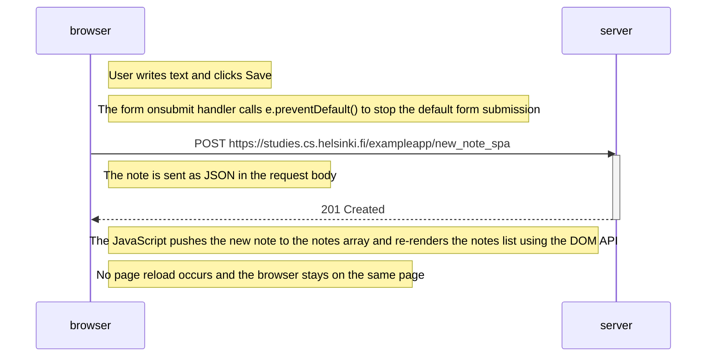

@'
# Exercise 0.6 - New note in the single-page app

```mermaid
sequenceDiagram
    participant browser
    participant server
    Note right of browser: User writes text and clicks Save
    Note right of browser: The form onsubmit handler calls e.preventDefault() to stop the default form submission
    browser->>server: POST https://studies.cs.helsinki.fi/exampleapp/new_note_spa
    activate server
    Note right of browser: The note is sent as JSON in the request body
    server-->>browser: 201 Created
    deactivate server
    Note right of browser: The JavaScript pushes the new note to the notes array and re-renders the notes list using the DOM API
    Note right of browser: No page reload occurs and the browser stays on the same page
```
'@ | Set-Content -Path part0\exercise_0.6.md